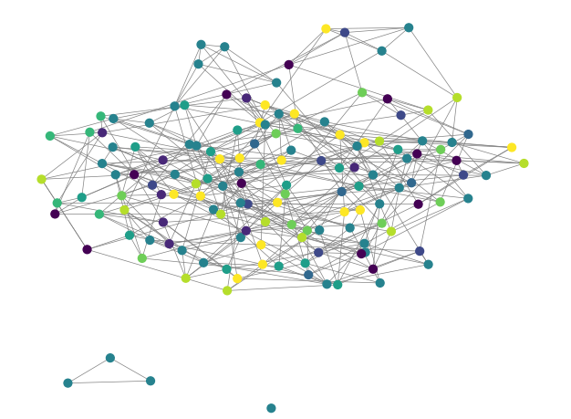

# 实验报告：K-means算法的实现
2351582  程亦诚
## 1. 实验背景与目的
K-Means是一种经典的聚类算法，广泛应用于数据挖掘、图像处理、模式识别等领域。本次实验的目的是通过编写K-Means算法，并在自定义数据集上进行测试，验证算法的有效性。实验中还将采用多种可视化方法展示聚类结果，以便更直观地理解聚类效果。

## 2. 算法原理
K-Means算法的核心思想是通过迭代优化，将数据集划分为K个簇，使得每个簇内的样本点尽可能相似，而不同簇之间的样本点尽可能不同。具体步骤如下：

**初始化**：随机选择K个质心（centroids）。

**分配**：将每个样本点分配到距离最近的质心所在的簇。

**更新**：重新计算每个簇的质心。

**迭代**：重复步骤2和步骤3，直到质心不再变化或达到最大迭代次数。

## 3. 代码实现
### 3.1 项目结构
```plaintext
K-means/
├── data/
│   ├── source/  数据集内容
│   ├── data.txt    保存的图的信息
│   └── graph.txt   保存的邻接矩阵
├── get_data.py  包含数据清洗、筛选、格式化的工具
├── K-means.py   实现K-means算
├── main.py      主函数
├── result.py    调用本文件以使用保存的中间数据
├── environment.yml 环境信息和依赖库
└── visualization.py  包含数据可视化的工具
```
### 3.2 K-Means算法代码
K-Means算法的实现代码如下：


```python
import numpy as np

def kmeans(X, K, max_iters=100, tol=1e-4):
    # 初始化 K 个随机质心
    centroids = X[np.random.choice(X.shape[0], K, replace=False)]
    
    for i in range(max_iters):
        # 计算每个样本到 K 个质心的距离
        distances = np.linalg.norm(X[:, np.newaxis] - centroids, axis=2)
        labels = np.argmin(distances, axis=1)
        
        # 更新质心
        old_centroids = centroids.copy()
        for k in range(K):
            centroids[k] = X[labels == k].mean(axis=0)
        
        # 判断是否收敛
        if np.linalg.norm(centroids - old_centroids) < tol:
            break
    
    return centroids, labels
```

### 3.3 可视化
为了更直观地展示聚类结果，我们使用了两种可视化方法：

- 使用Matplotlib库绘制二维散点图，并将不同簇的样本点用不同颜色表示
```python
def visulize_3d_plots(X, Y, Z, colors, labels):
    fig = plt.figure(figsize = (10, 8))
    ax = fig.add_subplot(111, projection='3d')

    scatter = ax.scatter(X, Y, Z, marker='o', c = colors, s = 10)
    for i, txt in enumerate(labels):
        ax.text(X[i], Y[i], Z[i], txt, size=2, zorder=1, color='red')

    fig.colorbar(scatter, ax=ax, shrink=0.5, aspect=5)

    plt.title("3D")
    plt.show()

def visualize_2d_plots(X, Y, colors, labels):
    fig, ax = plt.subplots()

    scatter = ax.scatter(X, Y, marker='o', c=colors, s = 10)
    for i, txt in enumerate(labels):
        ax.text(X[i], Y[i], txt, size=5, zorder=1, color='red')

    plt.title("2D ")
    plt.show()

```

- 使用networkx绘制无向图
```python
def visualize_undirected_graph(adj_matrix, labels, colors):
    # 检查邻接矩阵是否对称（无向图的邻接矩阵必须对称）
    if not np.allclose(adj_matrix, adj_matrix.T):
        raise ValueError("邻接矩阵必须是关于主对角线对称的（无向图）。")
    
    # 创建一个无向图
    G = nx.Graph()
    
    # 添加节点
    num_nodes = adj_matrix.shape[0]
    G.add_nodes_from(range(num_nodes))
    
    # 添加边（根据邻接矩阵）
    for i in range(num_nodes):
        for j in range(i + 1, num_nodes):  # 只遍历上三角部分
            if adj_matrix[i, j] != 0:
                G.add_edge(i, j)
    
    
    # 绘制图
    pos = nx.spring_layout(G, k=0.1, iterations=10, scale=2) 
    nx.draw(G, pos, with_labels=False, node_color=colors, node_size=40, edge_color='gray', width=0.5)
    # nx.draw_networkx_labels(G, pos, labels=labels, font_size=12, font_color='black')
    
    # 显示图
    plt.title("graph")
    plt.show()
```
## 4. 测试说明
### 4.1 测试数据集
测试集的数据来源于本学期面向对象程序设计课程的学生源文件互验信息。每个学生与若干个其他学生互验程序，可以看做社交关系，全班同学可以形成一个社交网络图。

### 4.2 数据处理
从数据库取出的信息首先去除缺失、不全、不匹配的信息，同时连接课程老师的数据库用于纠正可能存在的错误，对于无法修正的互验信息，则选择舍去

从数据集中获取的社交关系信息形成社交关系图，然后使用谱嵌入计算出可以用于聚类的低维向量

### 4.2 测试结果
通过K-Means算法，我们成功地将数据集划分为若干个簇。


### 4.3 可视化结果
通过二维散点图，我们可以清晰地看到多个簇的分布情况。不同簇的样本点用不同颜色表示。
通过互验关系图可以清晰地看出哪些同学有密切的互验关系



## 6. 心得体会
通过本次实验，我深入理解了K-Means算法的原理和实现过程。K-Means算法虽然简单，但在处理大规模数据时具有较高的效率。然而，K-Means算法也有其局限性，如对初始质心敏感、无法处理非凸形状的簇等。在实际应用中，需要根据具体问题选择合适的聚类算法。
